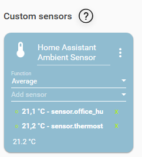
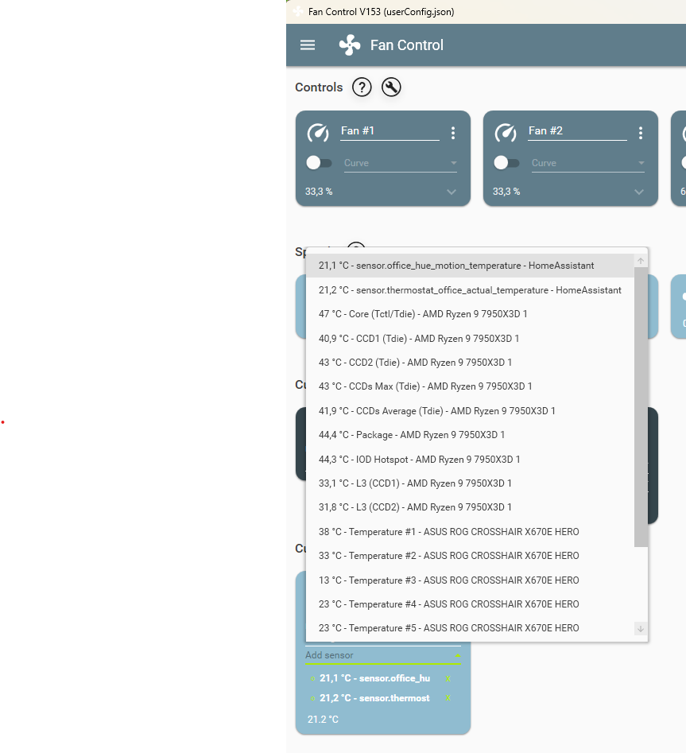
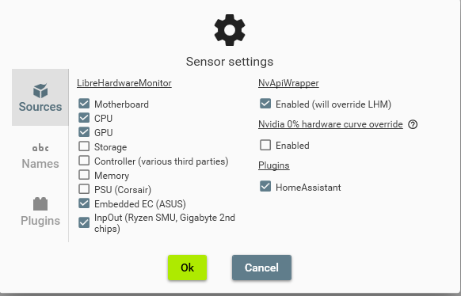
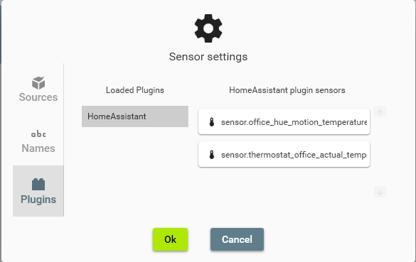

[](https://www.buymeacoffee.com/HenningGross)

# FanControl.HomeAssistant
[FanControl](https://github.com/Rem0o/FanControl.Releases)-Plugin for [HomeAssistant](https://www.home-assistant.io/) sensors.

- Integrates HomeAssistant temperature sensors into FanControl
- HomeAssistant for example provides Philips Hue Ambient temperature sensors or HomeMatic thermostat data as temperature sensors
- Initial use case: Implemented to be used as an ambient temperature sensor for a custom loop.


<p float="left">
  <a href="./doc/assets/FanControl.HomeAssistant_AmbientMixSensorExample.png">
    
  </a>
  <a href="./doc/assets/FanControl.HomeAssistant_AmbientMixSensorExample2.png"></a>
</p>

<p float="left">
  <a href="./doc/assets/FanControl.HomeAssistant_Settings1.png"></a>
  <a href="./doc/assets/FanControl.HomeAssistant_Settings2.png"></a>
</p>

## Installation
Download the latest release and drop the `.dll`- files into FanControl's `Plugins` folder.

## Configuration
The Plugin Expects a file `FanControl.HomeAssistant.json` within FanControl's `Configurations` directory (next to your default `userConfig.json`).
If this file is not found, a non-working default configuration file will be created. Check the error log (accessible from the FanControl menu).
The default configuration file will look like this 
```json
{
    "HomeAssistantAuthToken": "your_long_lived_access_token_created_from_home_assistants_user_configuration",
    "HomeAssistantURL": "http://example.com:8123",
    "sensors": [
        {
            "EntityId": "sensors.your_temp_sensor_entity_id",
            "PollingInterval": 10,
            "InitialFallbackValue": 10.0
        }
    ]
}
```

|Config entry|Description|
|-|-|
|HomeAssistantAuthToken (mandatory)|The auth token used to retrieve sensor data. Create one from the [HomeAssistant UI](https://www.home-assistant.io/docs/authentication/#your-account-profile)|
|HomeAssistantURL (mandatory)|The Home Assistant URL of your installation including protocol and port.|
|sensors|A list of home assistant (temperature) sensors that you want to have accessible within FanControl. Check how to define a sensors below.|

Sensors can be configured with these attribtues

|Sensor Config entry|Description|Default|
|-|-|-|
|EntityId (mandatory)|The home assistant entity id to resolve. Must be a tempearture sensor.|-|
|PollingInterval (optional)|The interval in seconds to poll data from HomeAssistant.|30|
|InitialFallbackValue (optional)|An initial value that is used to initialize the sensor. Will be overridden on first successful retrieval from HomeAssistant. Note that this value is used when home assistant is down or can't be reached initially.|20|

## Development
See [development docs](./DEVELOPMENT.md)